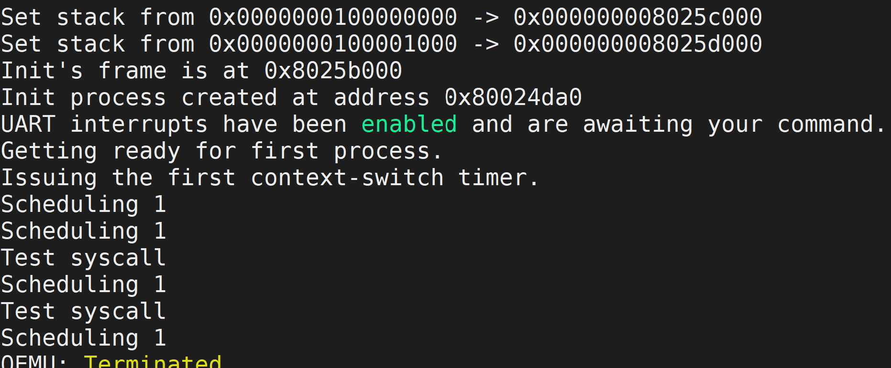

# **The Adventures of OS**

使用Rust的RISC-V操作系统  
[**在Patreon上支持我!**](https://www.patreon.com/sgmarz)  [**操作系统博客**](http://osblog.stephenmarz.com/)  [**RSS订阅** ](http://osblog.stephenmarz.com/feed.rss)  [**Github** ](https://github.com/sgmarz)  [**EECS网站**](http://web.eecs.utk.edu/~smarz1)  
这是[用Rust编写RISC-V操作系统](http://osblog.stephenmarz.com/index.html)系列教程中的第8章。  
[目录](http://osblog.stephenmarz.com/index.html) → [第7章](http://osblog.stephenmarz.com/ch7.html) → (第8章) → [第9章](http://osblog.stephenmarz.com/ch9.html)

# 启动一个进程

**<span style='color:red'>2020年3月10日: 仅Patreon</span>**  
**<span style='color:red'>2020年3月16日: 公开</span>**

## 视频和参考资料

我在我的大学里教过操作系统，所以我将在此处链接我在该课程中关于进程的笔记。

[https://www.youtube.com/watch?v=eB3dkJ2tBK8](https://www.youtube.com/watch?v=eB3dkJ2tBK8)

[OS Course Notes: Processes](https://web.eecs.utk.edu/~smarz1/courses/cosc361/notes/processes/)

上面的笔记是对进程作为一个概念的一般概述，我们在这里构建的操作系统可能会不太一样，大部分是因为它是用 Rust 编写的——在这里插入笑话。

## 概述

启动一个进程是我们一直在等待的，操作系统的工作本质上是支持正在运行的进程，在这篇文章中，我们将从操作系统的角度以及 CPU 的角度来看一个进程。

我们在上一章中查看了进程内存，但其中一些已被修改，以便我们拥有一个常驻内存空间（在堆上）。 此外，我将向您展示如何从内核模式进入用户模式，现在我们已经删除了主管 (supervisor) 模式，但是当回顾系统调用以支持进程时，我们会修复它。

## 进程结构体

进程结构大致相同，但在CPU方面，我们只关心*TrapFrame*结构。

```rust

#[repr(C)]
#[derive(Clone, Copy)]
pub struct TrapFrame {
  pub regs:       [usize; 32], // 0 - 255
  pub fregs:      [usize; 32], // 256 - 511
  pub satp:       usize,       // 512 - 519
  pub trap_stack: *mut u8,     // 520
  pub hartid:     usize,       // 528
}

```

我们不会使用所有这些字段，而现在我们只关心寄存器上下文（pub regs）。 当我们捕获一个陷入时，我们会将当前在 CPU 上执行的进程存储到 regs 陷入帧中，因此我们在处理陷入时保留该过程并冻结它。

```armasm

csrr	a0, mepc
csrr	a1, mtval
csrr	a2, mcause
csrr	a3, mhartid
csrr	a4, mstatus
csrr	a5, mscratch
la		t0, KERNEL_STACK_END
ld		sp, 0(t0)
call	m_trap

```

在陷入中，在我们保存了上下文之后，我们开始向 Rust 陷入处理程序 m_trap 提供信息，这些参数必须与 Rust 中的顺序匹配。 最后，请注意我们将 KERNEL_STACK_END 放入堆栈指针。 当我们保存它们时，实际上没有任何寄存器发生变化（除了 a0-a5、50 和现在的 sp），但是当我们跳转到 Rust 时，我们需要一个内核栈。

## 调度

我添加了一个非常简单的调度程序，它只是轮换进程列表，然后检查最前面的进程。 目前还没有办法改变进程状态，但是每当我们找到一个正在运行的进程时，我们就会抓取它的数据，然后将它放在 CPU 上。

```rust

pub fn schedule() ->  (usize, usize, usize) {
  unsafe {
    if let Some(mut pl) = PROCESS_LIST.take() {
      pl.rotate_left(1);
      let mut frame_addr: usize = 0;
      let mut mepc: usize = 0;
      let mut satp: usize = 0;
      let mut pid: usize = 0;
      if let Some(prc) = pl.front() {
        match prc.get_state() {
          ProcessState::Running => {
            frame_addr =
              prc.get_frame_address();
            mepc = prc.get_program_counter();
            satp = prc.get_table_address() >> 12;
            pid = prc.get_pid() as usize;
          },
          ProcessState::Sleeping => {
            
          },
          _ => {},
        }
      }
      println!("Scheduling {}", pid);
      PROCESS_LIST.replace(pl);
      if frame_addr != 0 {
        // MODE 8 是 39 位虚拟地址 MMU
        // 我使用 PID 作为地址空间标识符，
        // 希望在我们切换进程时帮助（不？）刷新 TLB。
        if satp != 0 {
          return (frame_addr, mepc, (8 << 60) | (pid << 44) | satp);
        }
        else {
          return (frame_addr, mepc, 0);
        }
      }
    }
  }
  (0, 0, 0)
}

```

这不是一个好的调度程序，但它可以满足我们的需要。 在这种情况下，调度程序返回的只是运行进程所需的信息，每当我们执行上下文切换时，我们都会询问调度程序并获得一个新进程，有可能得到完全相同的过程。

您会注意到，如果我们没有找到进程，我们会返回 (0, 0, 0)，这实际上是此操作系统的错误状态，我们将需要至少一个进程（init）。 在这里，我们将 yield，但现在，它只是循环通过系统调用将消息打印到屏幕上。

```rust

// 我们最终会将这个函数移出这里，
// 但它的工作只是在进程列表中占据一个位置。
fn init_process() {
  // 在我们有系统调用之前，我们不能在这里做很多事情，
  // 因为我们是在用户空间中运行的。
  let mut i: usize = 0;
  loop {
    i += 1;
    if i > 70_000_000 {
      unsafe {
        make_syscall(1);
      }
      i = 0;
    }
  }
}

```

## 切换到用户

```armasm

.global switch_to_user
switch_to_user:
  # a0 - Frame address
  # a1 - Program counter
  # a2 - SATP Register
  csrw    mscratch, a0

  # 1 << 7 is MPIE
  # Since user mode is 00, we don't need to set anything
  # in MPP (bits 12:11)
  li		t0, 1 << 7 | 1 << 5
  csrw	mstatus, t0
  csrw	mepc, a1
  csrw	satp, a2
  li		t1, 0xaaa
  csrw	mie, t1
  la		t2, m_trap_vector
  csrw	mtvec, t2
  # This fence forces the MMU to flush the TLB. However, since
  # we're using the PID as the address space identifier, we might
  # only need this when we create a process. Right now, this ensures
  # correctness, however it isn't the most efficient.
  sfence.vma
  # A0 is the context frame, so we need to reload it back
  # and mret so we can start running the program.
  mv	t6, a0
  .set	i, 1
  .rept	31
    load_gp %i, t6
    .set	i, i+1
  .endr
  
  mret  

```

当我们调用这个函数时，我们不能期望重新获得控制权，那是因为我们加载了我们想要运行的下一个进程（通过它的陷入帧上下文），然后我们在执行 mret 指令时通过 mepc 跳转到该代码。

## 整合起来

那么，这如何结合在一起呢？ 好吧，我们将来某个时候会发出一个上下文切换计时器。 当我们遇到这个陷入时，我们调用调度程序来获取一个新进程，然后我们切换到该进程，从而重新启动 CPU 并退出陷入。

```rust

7 => unsafe {
  // 这是上下文切换计时器。
  // 我们通常会在这里调用调度程序来选择另一个进程来运行。
  // 机器定时器 Machine timer
  // println!("CTX");
  let (frame, mepc, satp) = schedule();
  let mtimecmp = 0x0200_4000 as *mut u64;
  let mtime = 0x0200_bff8 as *const u64;
  // QEMU 给出的频率是 10_000_000 Hz，
  // 因此这会将下一个中断设置为从现在开始一秒后触发。
  // 这对于正常操作来说太慢了，但它能让我们看到屏幕后发生的事情。
  mtimecmp.write_volatile(mtime.read_volatile() + 10_000_000);
  unsafe {
    switch_to_user(frame, mepc, satp);
  }
},

```

我们再次缩短了 m_trap 函数，但是请看一下陷入处理程序，我们每次都重置内核栈，这对于单个 hart 系统来说很好，但是当我们进行多处理时我们必须更新它。

## 结论

启动一个进程并不是什么大不了的事，但是它要求我们暂时放下我们曾经想的编程方式。 我们正在调用一个函数（switch_to_user），这将使 Rust 不再起作用，但它仍然可以工作？！ 为什么，好吧，我们正在使用 CPU 来改变我们想要去的地方，Rust 是不明智的。

现在，我们的操作系统处理中断和调度进程，当我们运行时，我们应该看到以下内容！

<div align=center>



</div>

每当我们执行上下文切换计时器时，我们都会看到“调度 1”，现在是每秒 1 个，这对于普通的操作系统来说太慢了，但它给了我们足够的时间来看看发生了什么。 然后，进程本身 init_process 在 70,000,000 次迭代后进行系统调用，然后将“Test syscall”打印到屏幕上。

我们知道我们的进程调度程序正在运行，并且我们知道我们的进程本身正在 CPU 上执行。 因此，我们成功了！

[目录](http://osblog.stephenmarz.com/index.html) → [第7章](http://osblog.stephenmarz.com/ch7.html) → (第8章) → [第9章](http://osblog.stephenmarz.com/ch9.html)
